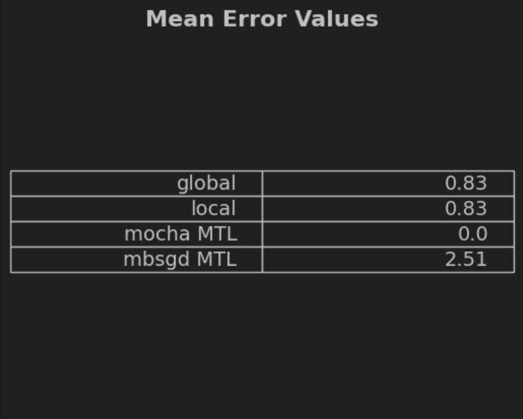

# Federated Multi-Task Learning
---
Federated learning is new ML technique that uses multiple independent sessions (nodes), each with its own dataset, to train a model.

FL poses new statistical and systems challenges, namely:
- Since each node has its own dataset, data on each node may follow different distributions. Also, the number of data points may vary significantly, and there may be an underlying structure that captures the relationship between nodes and their distributions.
- As the number of nodes in the network increases, communication speed becomes a bottleneck.
- The storage, computational, and communication capacities of each node may differ, which makes the network less fault tolerable.

## Importance of This Algorithm
The authors mention a number of potential applications of federated learning: learning sentiment, semantic location, activities of mobile phone users, predicting health events like low blood sugar or heart attach risk, or detecting burglaries.

In general, this algorithm is important because it is an advanced version of classical distributed learning.

## Main Idea of the Approach
Recently, storage and computational power of modern devices have increased signficantly, so it is more appealing to push data storage and computations to the network edge.

Authors propose to learn separate models for each node through multi-task learning (MTL), as opposed to training a single global model across the network.

## What It Is Based on
This paper is based on three ideas:
1. Learning Beyond the Data Center - training ML models locally on distributed networks rather than centrally. This approach is now available as the computational power is growing. However, existing solutions cannot deal tith non-IID data and are not fault-tolerable
2. Multi-Task Learning. It involves learning models for multiple related tasks simultaneously. Current solutions can work with non-IID and imbalanced data, but are not suited for distributed systems.
3. Distributed Multi-Task Learning - a new area of research that still cannot balance well between computation and communication; as a result this approach has low fault tolerance. However, a method that leverages the distirbuted framework CoCoA was proposed.

CoCoA is a special case of a more general approach proposed by the authors - Mocha.

## Key Features of the Proposed Method
The only key feature of the proposed Mocha method is that it can handle the unique systems challenges of the federated environment.

Instead of waiting for responses from all workers before performing a synchronous update (which leads too problems), it allows nodes to approximately solve their subproblems, where the quality of approximation is controlled by a per-node parameters.

Thus, it creates a framework for Federated Multi-Task Learning.

## Intuition Behind the Method
Intuitivly, We believe that MOCHA works better than the previously proposed frameworks mainly due to two reasons :
  1. Avoids Stragglers effects by providing $t-th$ node to flexibilly approximately solve the node's subproblem
  2. the approach is based on bi-convex alternation, thus guaranteed to converge.

## Improvements over the Basic Algorithms

The general setup for MTL is as follows 

$$ min_{W,\Omega}{\sum_{t=1}^{m}\sum_{i=1}^{n_t} l_t(w_t^T x_t^i , y_t^i) + R(W, \Omega)}$$

in which $W := [w_1, ..., w_m] \in R^{d*m}$ is a matrix whose $t-th$ column is the weight vector of the $i-th$ task. While the matrix $ \Omega \in R^{m*m} $ models relations between tasks and either known or estimated while learning task models. The paper propose new approach to solve the minimization optimization problem alternatively by fixing $\Omega$ and optimizing over $W$ and vice versa. However, when solving for $\Omega$ is not dependant on the input data thus, unlike previous approaches, $\Omega$ now could be computed centrally.  

# Reproducing Paper Results
## Data Preprocessing
The dataset is preprocessed to prepare it for training the models.

## Gridsearch with Shuffling
To ensure fairness, we implemented grid search for 10 trials. In each trial, the dataset is shuffled, and the grid search is performed over the regularizer parameter.

## Hyperparameters
We used all recommended hyperparameters mentioned by the authors, except for the inner iterations count, which was reduced to accommodate computational limitations.

##Experimental Setup
The experiment includes three different model types:

1. Fully Local Model 

- SVM models are trained for each local node.
- Predictions are averaged.
- You can find its implementation in opt/baselines.py
  
2- Fully Global Model

- A single SVM model is trained using all available data.
- You can find its implementation in opt/baselines.py
  
3. Multitask Learning Models (MBSGD and MOCHA)

- SVM is used in both.
- MBSGD involves stochastic gradient descent.
- MOCHA uses a different approach.
- You can find their implementations in opt/mbsgd.py and opt/mocha.py respectively

Results
After conducting the experiments with 10 trials of a gridsearch on lambda regularization parameter, the mean error of prediction was calculated for each model type. Interestingly, the MOCHA model outperformed the rest with a significant margin. It is noted that MBSGD might have performed better with a higher number of iterations. Surprisingly, the fully local and fully global models did not show a significant difference in performance on this specific dataset.

